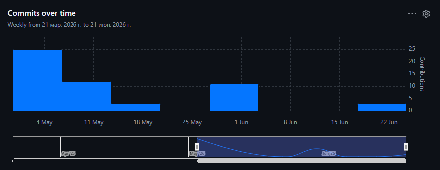
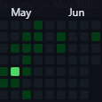

# kanbaNice

Корпоративная Kanban-система для управления проектами и задачами в командах.  
Траектория: **Г — Enterprise (полный стек)**

---

## Содержание

- [Описание](#описание)
- [Технологический стек](#технологический-стек)
- [Архитектура](#архитектура)
- [Структура репозитория](#структура-репозитория)
- [Быстрый старт](#быстрый-старт)
- [REST API](#rest-api)
- [Статистика разработки](#статистика-разработки)

---

## Описание

**kanbaNice** — многопользовательская система управления проектами по методологии Kanban.  
Позволяет командам создавать компании, проекты, канбан-доски и задачи, отслеживать статус выполнения и взаимодействовать через веб- или десктопный интерфейс.

**Ключевые возможности:**
- Регистрация и аутентификация (JWT + OAuth2 через Google)
- Управление компаниями и сотрудниками
- Создание проектов с разграничением ролей (Leader / Worker)
- Канбан-доски с задачами (статусы: TODO / DONE)
- Два типа клиентов: веб (React) и десктоп (JavaFX)
- Восстановление пароля по email
- Полная контейнеризация (Docker + Nginx + PostgreSQL)

---

## Технологический стек

| Компонент | Технология |
|-----------|-----------|
| Серверный язык | Java 17 |
| Серверный фреймворк | Spring Boot 3 |
| Аутентификация | Spring Security, JWT (JJWT 0.12.6), OAuth2 |
| База данных | PostgreSQL 16 |
| ORM | Spring Data JPA / Hibernate |
| Документация API | SpringDoc OpenAPI 2.5 (Swagger UI) |
| Сборка бэкенда | Maven |
| Веб-клиент | React 19, Vite, Axios, React Router DOM 7 |
| Десктоп-клиент | JavaFX 21, Jackson |
| Реверс-прокси | Nginx (SSL/TLS) |
| Контейнеризация | Docker, Docker Compose |

---

## Архитектура

Система построена по паттерну **PCMEF** (Presentation–Control–Mediator–Entity–Foundation):

```
┌─────────────────────────────────────────┐
│  Presentation (P)                       │
│  React (Web)  │  JavaFX (Desktop)       │
└───────────────┬─────────────────────────┘
                │ HTTP / REST API
┌───────────────▼─────────────────────────┐
│  Control (C) — controller/              │
│  AuthController, UserController,        │
│  CompanyController, ProjectController,  │
│  BoardController, TaskController        │
└───────────────┬─────────────────────────┘
                │
┌───────────────▼─────────────────────────┐
│  Mediator (M) — service/                │
│  AuthService, UserService,              │
│  CompanyService, ProjectService,        │
│  BoardService, TaskService              │
└───────────────┬─────────────────────────┘
                │
┌───────────────▼─────────────────────────┐
│  Entity (E) — entity/                   │
│  User, Company, KanbanProject,          │
│  KanbanBoard, KanbanTask, ProjectMember │
└───────────────┬─────────────────────────┘
                │
┌───────────────▼─────────────────────────┐
│  Foundation (F) — Repository/           │
│  UserRepository, KanbanProjectRepo,     │
│  KanbanBoardRepo, KanbanTaskRepo,       │
│  ProjectMemberRepo                      │
└─────────────────────────────────────────┘
```

---

## Структура репозитория

```
kanbaNice/
├── README.md
├── docker-compose.yml
├── backend/               # Spring Boot — серверная часть
│   ├── Dockerfile
│   ├── pom.xml
│   └── src/main/java/com/kanbanice/backend/
│       ├── controller/    # C — Control
│       ├── service/       # M — Mediator
│       ├── entity/        # E — Entity
│       ├── Repository/    # F — Foundation
│       ├── dto/           # Объекты передачи данных
│       ├── Security/      # JWT, OAuth2, Spring Security
│       ├── Config/        # SecurityConfig, SwaggerConfig, WebConfig
│       └── Exception/     # Глобальная обработка ошибок
├── frontend/              # React + Vite — веб-клиент
│   ├── Dockerfile
│   ├── package.json
│   └── src/
│       ├── pages/         # Страницы (Login, Register, Company, Project, Profile...)
│       ├── components/    # Переиспользуемые компоненты
│       ├── context/       # UserContext, CompanyContext, ProjectContext
│       └── api/           # HTTP-клиент (Axios)
├── desktop/               # JavaFX — десктопный клиент
│   ├── pom.xml
│   └── src/main/java/com/kanbanice/desktop/
│       ├── view/          # Экраны (Login, Signup, Company, Projects, Board, Profile)
│       ├── api/           # REST-клиент
│       ├── model/         # Модели данных
│       └── state/         # AppState (хранилище состояния)
├── nginx/                 # Реверс-прокси
│   ├── Dockerfile
│   └── nginx.conf
└── docs/                  # Проектная документация
    ├── 00-initiation/
    ├── 01-requirements/
    ├── 02-architecture/
    ├── 03-database/
    ├── 04-design/
    ├── 05-implementation/
    ├── 06-refactoring/
    ├── 07-management/
    └── images/
```

---

## Быстрый старт

### Предварительные требования

- Docker Desktop 24+
- Git

### Запуск через Docker Compose

```bash
git clone https://github.com/firemon217/kanbaNice.git
cd kanbaNice
docker-compose up --build
```

После запуска доступно:
- Веб-интерфейс: http://localhost
- Swagger UI: http://localhost:8080/swagger-ui.html
- Backend API: http://localhost:8080

### Запуск десктопного клиента

```bash
cd desktop
./mvnw javafx:run
# или на Windows:
mvnw.cmd javafx:run
```

---

## REST API

Полная документация: **http://localhost:8080/swagger-ui.html**

| Метод | Маршрут | Описание |
|-------|---------|----------|
| POST | /auth/login | Вход в систему |
| POST | /auth/signup | Регистрация |
| GET | /api/users/profile | Получить профиль |
| PUT | /api/users/profile | Обновить профиль |
| POST | /api/users/forgot-password | Запрос сброса пароля |
| POST | /api/users/reset-password | Сброс пароля по токену |
| DELETE | /api/users/profile | Удалить аккаунт |
| GET | /api/company | Получить свою компанию |
| POST | /api/company | Создать компанию |
| PUT | /api/company | Обновить компанию |
| DELETE | /api/company | Удалить компанию |
| POST | /api/company/workers | Добавить сотрудника |
| DELETE | /api/company/workers/{id} | Удалить сотрудника |
| GET | /api/projects | Список проектов |
| POST | /api/projects | Создать проект |
| GET | /api/projects/{id} | Получить проект |
| DELETE | /api/projects/{id} | Удалить проект |
| POST | /api/projects/{id}/members/{userId} | Добавить участника |
| GET | /api/projects/{id}/boards | Список досок |
| POST | /api/projects/{id}/boards | Создать доску |
| PUT | /api/projects/boards/{boardId} | Обновить доску |
| DELETE | /api/projects/boards/{boardId} | Удалить доску |
| GET | /api/projects/boards/{boardId}/tasks | Список задач |
| POST | /api/projects/boards/{boardId}/tasks | Создать задачу |
| GET | /api/projects/tasks/{taskId} | Получить задачу |
| PUT | /api/projects/tasks/{taskId} | Обновить задачу |
| DELETE | /api/projects/tasks/{taskId} | Удалить задачу |

**Итого: 27 эндпоинтов** (требование Enterprise — 15+)

---

## Статистика разработки

### Метрики Git

- Всего коммитов: см. `git log --oneline | wc -l`
- Период разработки: май 2026 — июнь 2026
- Ветки: `main`

### График активности

> Скриншот добавляется перед сдачей проекта.  
> Путь: `docs/images/git-commit-activity.png`



### Тепловая карта

> Скриншот добавляется перед сдачей проекта.  
> Путь: `docs/images/git-punch-card.png`


