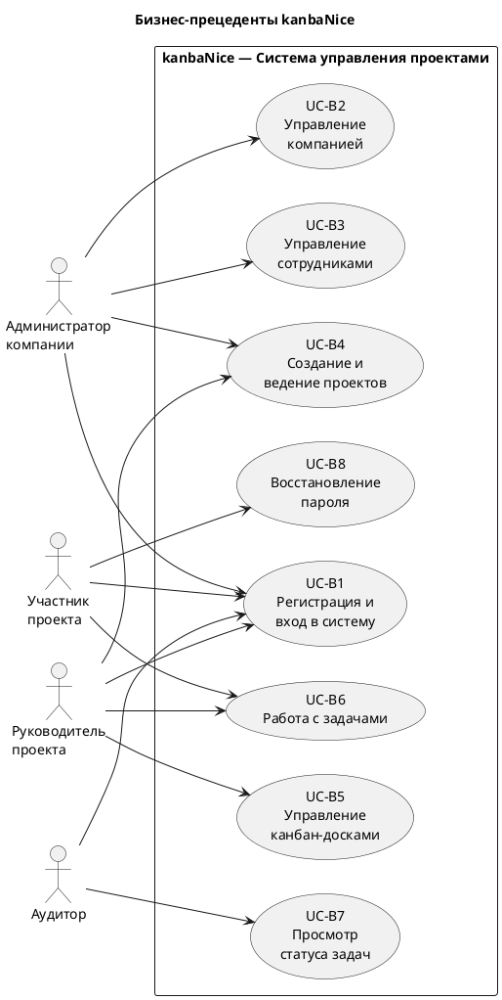

# BUC-диаграмма (Бизнес-прецеденты)

## Диаграмма

## Описание бизнес-прецедентов

| Код | Бизнес-прецедент | Акторы | Описание |
|-----|-----------------|--------|----------|
| UC-B1 | Регистрация и вход в систему | Все | Создание аккаунта (email/пароль или OAuth2 Google), авторизация по JWT |
| UC-B2 | Управление компанией | Admin | Создание, редактирование и удаление записи о компании |
| UC-B3 | Управление сотрудниками | Admin | Добавление и удаление сотрудников компании |
| UC-B4 | Создание и ведение проектов | Admin, Leader | Создание проектов, назначение участников с ролями |
| UC-B5 | Управление канбан-досками | Leader | Создание, редактирование и удаление досок внутри проекта |
| UC-B6 | Работа с задачами | Leader, Worker | Создание, обновление статуса и удаление задач |
| UC-B7 | Просмотр статуса задач | Auditor | Просмотр досок и задач без права изменения |
| UC-B8 | Восстановление пароля | User | Запрос ссылки сброса пароля на email |
