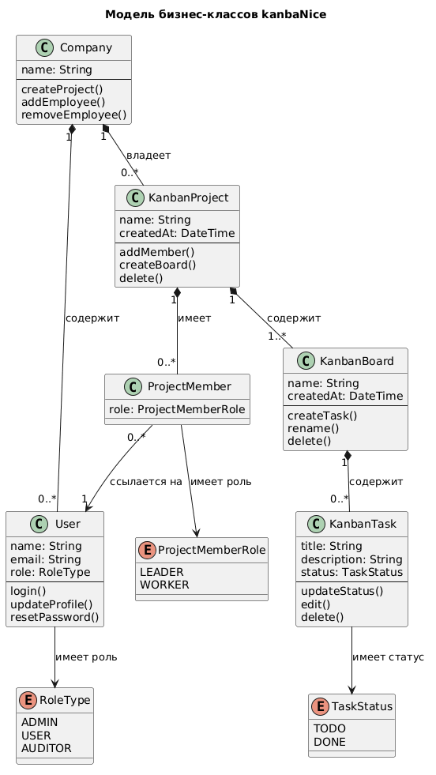

# Модель бизнес-классов (высокоуровневая)

## Диаграмма

## Описание классов

| Класс | Ответственность |
|-------|----------------|
| **Company** | Корневая организация; владеет пользователями и проектами |
| **User** | Участник системы с ролью и учётными данными |
| **KanbanProject** | Рабочая область с досками и командой |
| **ProjectMember** | Связь пользователя с проектом и ролью внутри него |
| **KanbanBoard** | Канбан-доска, хранящая задачи |
| **KanbanTask** | Атомарная единица работы со статусом |
