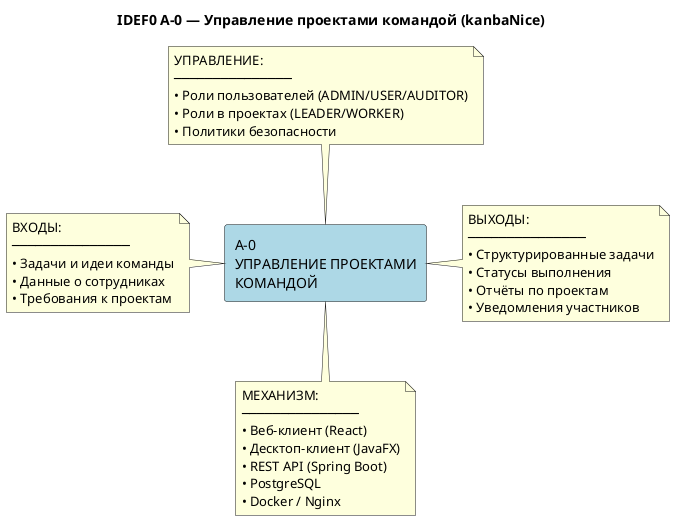

# Диаграмма бизнес-контекста (IDEF0 A-0)

## Контекстная диаграмма

## Описание

**Название функции:** Управление проектами и задачами команды  
**Уровень декомпозиции:** A-0 (контекстный)

### Входы
| Вход | Источник |
|------|----------|
| Задачи и пожелания команды | Участники (User) |
| Данные о сотрудниках | Администратор компании (Admin) |
| Требования к проектам | Руководитель проекта (Leader) |

### Выходы
| Выход | Получатель |
|-------|-----------|
| Структурированные Kanban-задачи | Участники проекта |
| Статусы выполнения задач | Руководитель проекта |
| Email-уведомления (сброс пароля) | Пользователи |

### Управляющие воздействия
- Роли системы: ADMIN, USER, AUDITOR
- Роли в проекте: LEADER, WORKER
- Политики безопасности: JWT, BCrypt, HTTPS

### Механизмы исполнения
- Веб-браузер + React SPA
- JavaFX Desktop приложение
- Spring Boot REST сервер
- PostgreSQL 16

---

## Декомпозиция A0 → A1..A5

| Код | Подфункция |
|-----|-----------|
| A1 | Управление учётными записями (регистрация, аутентификация, профиль) |
| A2 | Управление компанией и сотрудниками |
| A3 | Управление проектами и участниками |
| A4 | Управление канбан-досками |
| A5 | Управление задачами |
