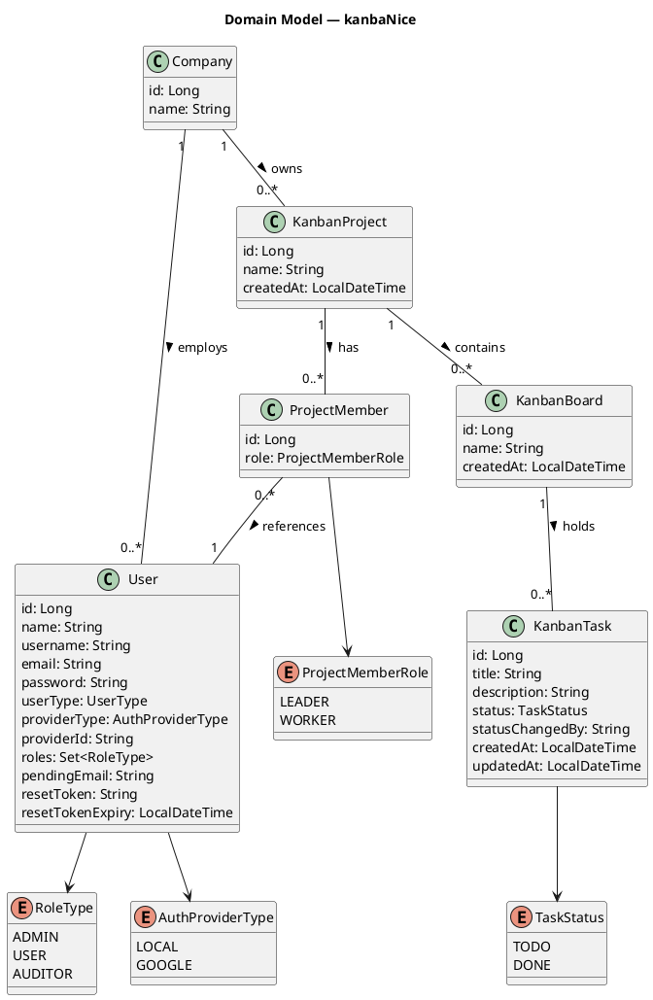

# Domain Model (концептуальная модель)

## Диаграмма

## Концептуальные связи

| Связь | Тип | Мощность | Описание |
|-------|-----|----------|----------|
| Company → User | Агрегация | 1 : 0..* | Компания объединяет пользователей |
| Company → KanbanProject | Композиция | 1 : 0..* | Проекты принадлежат компании |
| KanbanProject → KanbanBoard | Композиция | 1 : 1..* | Проект содержит доски |
| KanbanProject → ProjectMember | Композиция | 1 : 0..* | Проект имеет участников |
| KanbanBoard → KanbanTask | Композиция | 1 : 0..* | Доска содержит задачи |
| ProjectMember → User | Ассоциация | 0..* : 1 | Участник ссылается на пользователя |
