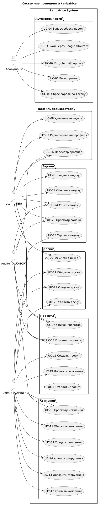

# Use Case Диаграмма (системные прецеденты)

## Диаграмма

## Сводная таблица

| Код | Прецедент | Акторы | Метод API |
|-----|-----------|--------|-----------|
| UC-01 | Регистрация | Anonymous | POST /auth/signup |
| UC-02 | Вход по паролю | Anonymous | POST /auth/login |
| UC-03 | Вход через Google | Anonymous | OAuth2 redirect |
| UC-04 | Запрос сброса пароля | Anonymous | POST /api/users/forgot-password |
| UC-05 | Сброс пароля | Anonymous | POST /api/users/reset-password |
| UC-06 | Просмотр профиля | User, Auditor | GET /api/users/profile |
| UC-07 | Редактирование профиля | User | PUT /api/users/profile |
| UC-08 | Удаление аккаунта | User | DELETE /api/users/profile |
| UC-09 | Создать компанию | Admin | POST /api/company |
| UC-10 | Просмотр компании | Admin, Auditor | GET /api/company |
| UC-11 | Обновить компанию | Admin | PUT /api/company |
| UC-12 | Удалить компанию | Admin | DELETE /api/company |
| UC-13 | Добавить сотрудника | Admin | POST /api/company/workers |
| UC-14 | Удалить сотрудника | Admin | DELETE /api/company/workers/{id} |
| UC-15 | Список проектов | User, Auditor | GET /api/projects |
| UC-16 | Создать проект | Admin | POST /api/projects |
| UC-17 | Просмотр проекта | User, Auditor | GET /api/projects/{id} |
| UC-18 | Удалить проект | Admin | DELETE /api/projects/{id} |
| UC-19 | Добавить участника | Admin | POST /api/projects/{id}/members/{userId} |
| UC-20 | Список досок | User, Auditor | GET /api/projects/{id}/boards |
| UC-21 | Создать доску | Admin | POST /api/projects/{id}/boards |
| UC-22 | Обновить доску | Admin | PUT /api/projects/boards/{boardId} |
| UC-23 | Удалить доску | Admin | DELETE /api/projects/boards/{boardId} |
| UC-24 | Список задач | User, Auditor | GET /api/projects/boards/{boardId}/tasks |
| UC-25 | Создать задачу | User | POST /api/projects/boards/{boardId}/tasks |
| UC-26 | Просмотр задачи | User, Auditor | GET /api/projects/tasks/{taskId} |
| UC-27 | Обновить задачу | User | PUT /api/projects/tasks/{taskId} |
| UC-28 | Удалить задачу | Admin | DELETE /api/projects/tasks/{taskId} |
