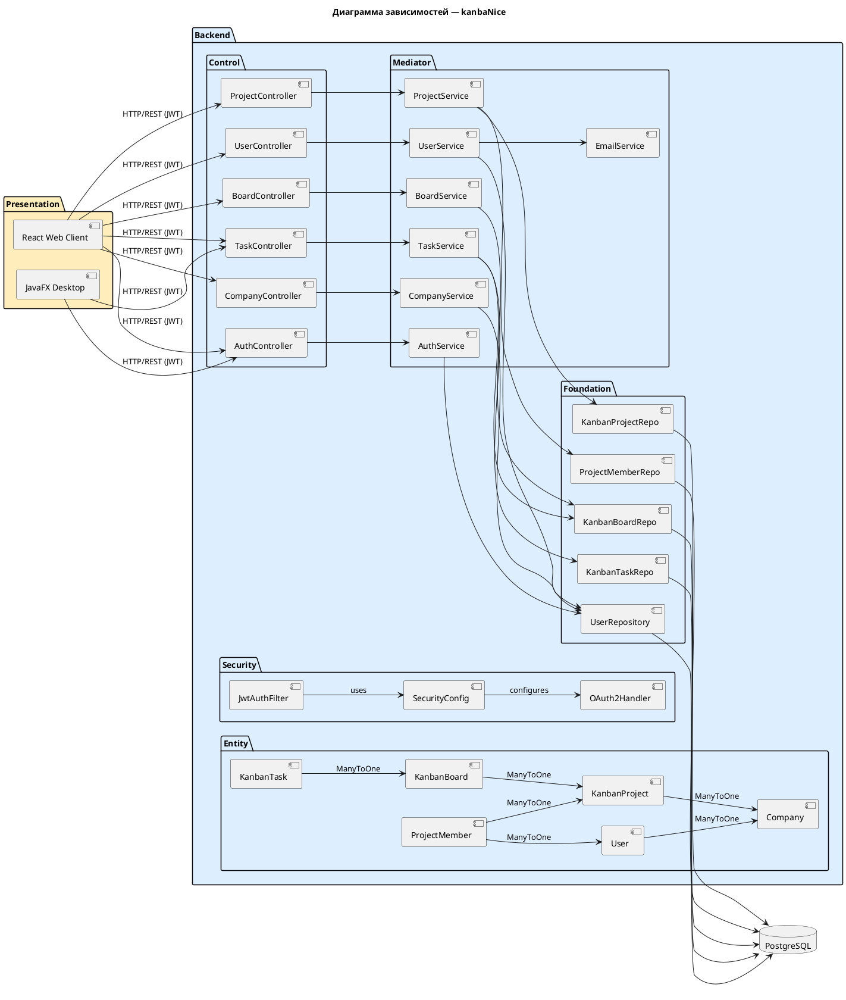

# Диаграмма зависимостей

## Зависимости между компонентами системы

## Правило «нет зависимости вверх»

| От слоя | К слою | Разрешено |
|---------|--------|----------|
| Presentation | Control | ✅ (HTTP) |
| Control | Mediator | ✅ |
| Mediator | Entity | ✅ |
| Mediator | Foundation | ✅ |
| Foundation | Entity | ✅ |
| Entity | Foundation | ❌ Запрещено |
| Foundation | Control | ❌ Запрещено |
| Mediator | Control | ❌ Запрещено |

Граф зависимостей **ацикличен** — нарушений принципа не обнаружено.
