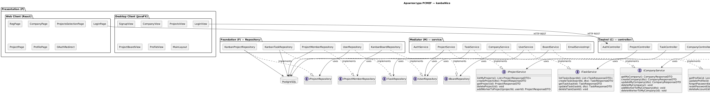

# Архитектура PCMEF — Диаграмма пакетов

## Диаграмма

## Принципы PCMEF в проекте

| Принцип | Реализация |
|---------|-----------|
| Зависимости строго вниз | P → C → M → E → F; обратных зависимостей нет |
| Изоляция слоёв | Каждый контроллер делегирует сервису; сервис не знает о HTTP |
| Коммуникация через интерфейсы | Сервисы объявлены как интерфейсы; Spring Data JPA — интерфейсные репозитории |
| Отсутствие циклических зависимостей | Spring IoC обеспечивает ацикличный граф зависимостей |

## Соответствие пакетов слоям

| Слой PCMEF | Java-пакет | Количество классов |
|-----------|-----------|-------------------|
| P — Presentation | React `pages/`, `components/` / JavaFX `view/` | 7 страниц + 7 экранов |
| C — Control | `controller/` | 6 контроллеров |
| M — Mediator | `service/` | 6 сервисов + EmailService |
| E — Entity | `entity/` | 10 сущностей + перечислений |
| F — Foundation | `Repository/` | 5 репозиториев |
