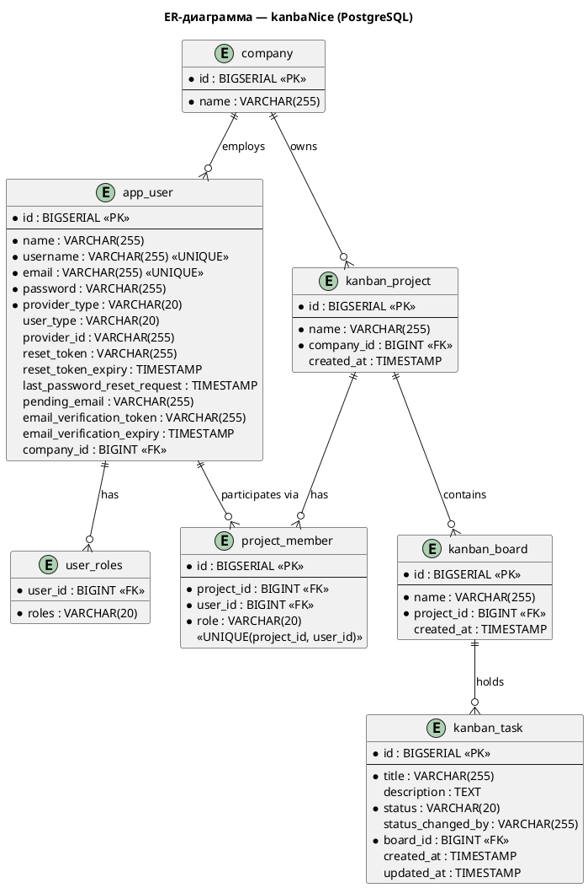

# ER-диаграмма (логическая модель данных)

## Диаграмма

## Описание таблиц

| Таблица | PK | Описание |
|---------|-----|---------|
| `app_user` | id | Учётные записи пользователей |
| `user_roles` | (user_id, roles) | Роли пользователя (ADMIN/USER/AUDITOR) |
| `company` | id | Организации |
| `kanban_project` | id | Проекты внутри компании |
| `project_member` | id | Участники проекта с ролью (LEADER/WORKER) |
| `kanban_board` | id | Канбан-доски проекта |
| `kanban_task` | id | Задачи на доске |

## Индексы

| Таблица | Поле(я) | Тип | Назначение |
|---------|---------|-----|-----------|
| `app_user` | `username` | UNIQUE | Быстрый поиск при аутентификации |
| `app_user` | `email` | UNIQUE | Поиск при OAuth2 и сбросе пароля |
| `project_member` | `(project_id, user_id)` | UNIQUE | Предотвращение дублирования участников |
| `kanban_project` | `company_id` | INDEX | Фильтрация проектов по компании |
| `kanban_board` | `project_id` | INDEX | Фильтрация досок по проекту |
| `kanban_task` | `board_id` | INDEX | Фильтрация задач по доске |

## Нормализация

- **1NF:** Все столбцы атомарны; роли вынесены в отдельную таблицу `user_roles`
- **2NF:** Все атрибуты зависят от первичного ключа (нет частичных зависимостей)
- **3NF:** Нет транзитивных зависимостей; все FK ссылаются на PK родительских таблиц
