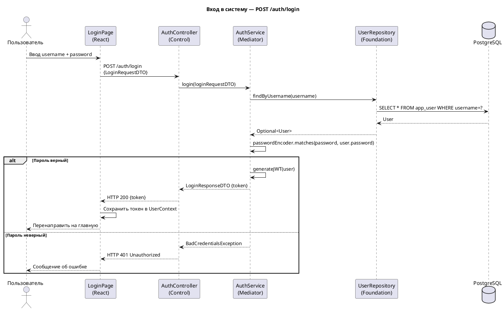
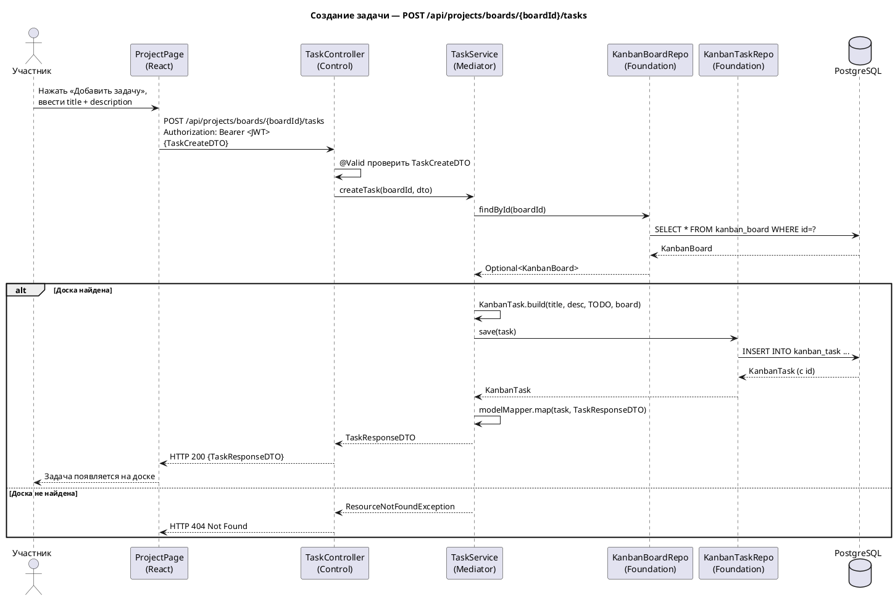
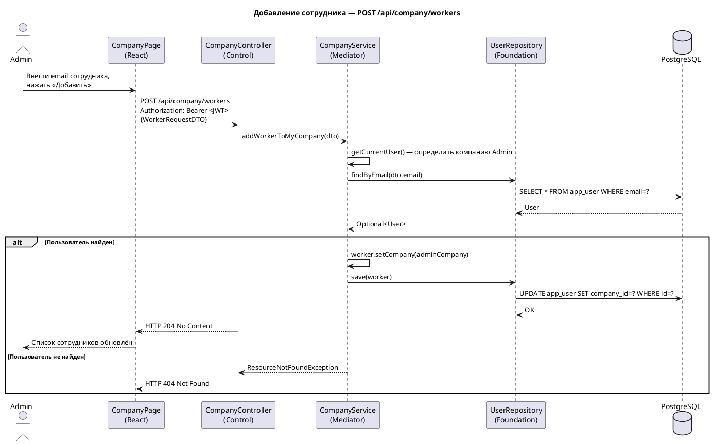
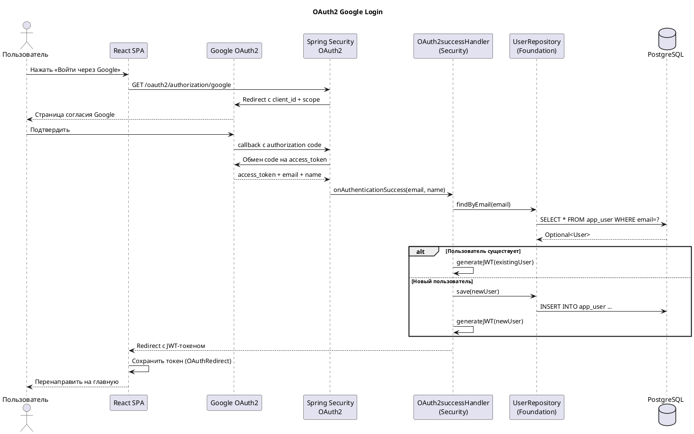

# Диаграммы последовательности

---

## Сценарий 1: Вход в систему (UC-02)

---

## Сценарий 2: Создание задачи (UC-25)

---

## Сценарий 3: Добавление сотрудника в компанию (UC-13)

---

## Сценарий 4: Вход через Google (OAuth2)

