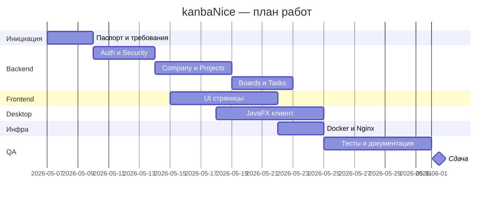

# ПОЯСНИТЕЛЬНАЯ ЗАПИСКА

## курсового проекта

**Тема:** Разработка приложения-системы управления разработкой проектов

**Выполнил:** студент группы ПИЖ-б-о-23-1  
**Проценко Дмитрий Максимович**

**Траектория:** Г — Enterprise (полный стек)

**Руководитель:** Новикова Е.Н., канд. физ.-мат. наук

**Город, год:** Ставрополь, 2026

## СОДЕРЖАНИЕ

ВВЕДЕНИЕ  
&nbsp;&nbsp;&nbsp;&nbsp;Актуальность  
&nbsp;&nbsp;&nbsp;&nbsp;Цель и задачи  
&nbsp;&nbsp;&nbsp;&nbsp;Объект и предмет исследования  

1. АНАЛИТИЧЕСКАЯ ЧАСТЬ  
&nbsp;&nbsp;&nbsp;&nbsp;1.1. Описание предметной области  
&nbsp;&nbsp;&nbsp;&nbsp;1.2. Анализ бизнес-процессов (IDEF0)  
&nbsp;&nbsp;&nbsp;&nbsp;1.3. SWOT-анализ текущего состояния  
&nbsp;&nbsp;&nbsp;&nbsp;1.4. Анализ аналогов и конкурентов  
&nbsp;&nbsp;&nbsp;&nbsp;1.5. Обоснование необходимости разработки  
&nbsp;&nbsp;&nbsp;&nbsp;1.6. Экономическое обоснование (ROI)  

2. ПРОЕКТНАЯ ЧАСТЬ  
&nbsp;&nbsp;&nbsp;&nbsp;2.1. Модель требований к ПО  
&nbsp;&nbsp;&nbsp;&nbsp;&nbsp;&nbsp;&nbsp;&nbsp;2.1.1. Use Case диаграмма  
&nbsp;&nbsp;&nbsp;&nbsp;&nbsp;&nbsp;&nbsp;&nbsp;2.1.2. Спецификация прецедентов  
&nbsp;&nbsp;&nbsp;&nbsp;&nbsp;&nbsp;&nbsp;&nbsp;2.1.3. Глоссарий терминов  
&nbsp;&nbsp;&nbsp;&nbsp;2.2. Модель предметной области  
&nbsp;&nbsp;&nbsp;&nbsp;&nbsp;&nbsp;&nbsp;&nbsp;2.2.1. Domain Model (диаграмма классов)  
&nbsp;&nbsp;&nbsp;&nbsp;&nbsp;&nbsp;&nbsp;&nbsp;2.2.2. Описание сущностей и атрибутов  
&nbsp;&nbsp;&nbsp;&nbsp;&nbsp;&nbsp;&nbsp;&nbsp;2.2.3. Бизнес-правила  
&nbsp;&nbsp;&nbsp;&nbsp;2.3. Архитектурное проектирование  
&nbsp;&nbsp;&nbsp;&nbsp;&nbsp;&nbsp;&nbsp;&nbsp;2.3.1. Выбор архитектурного стиля  
&nbsp;&nbsp;&nbsp;&nbsp;&nbsp;&nbsp;&nbsp;&nbsp;2.3.2. Диаграмма пакетов (PCMEF)  
&nbsp;&nbsp;&nbsp;&nbsp;&nbsp;&nbsp;&nbsp;&nbsp;2.3.3. Описание слоёв и их ответственности  
&nbsp;&nbsp;&nbsp;&nbsp;&nbsp;&nbsp;&nbsp;&nbsp;2.3.4. Архитектурные решения (ADR)  
&nbsp;&nbsp;&nbsp;&nbsp;2.4. Проектирование базы данных  
&nbsp;&nbsp;&nbsp;&nbsp;&nbsp;&nbsp;&nbsp;&nbsp;2.4.1. ER-диаграмма  
&nbsp;&nbsp;&nbsp;&nbsp;&nbsp;&nbsp;&nbsp;&nbsp;2.4.2. Физическая модель данных  
&nbsp;&nbsp;&nbsp;&nbsp;&nbsp;&nbsp;&nbsp;&nbsp;2.4.3. DDL-скрипты  
&nbsp;&nbsp;&nbsp;&nbsp;2.5. Детальное проектирование  
&nbsp;&nbsp;&nbsp;&nbsp;&nbsp;&nbsp;&nbsp;&nbsp;2.5.1. Диаграммы последовательности  
&nbsp;&nbsp;&nbsp;&nbsp;&nbsp;&nbsp;&nbsp;&nbsp;2.5.2. Диаграммы классов проектирования  
&nbsp;&nbsp;&nbsp;&nbsp;&nbsp;&nbsp;&nbsp;&nbsp;2.5.3. Применение паттернов GoF  

3. РЕАЛИЗАЦИОННАЯ ЧАСТЬ  
&nbsp;&nbsp;&nbsp;&nbsp;3.1. Реализация бизнес-логики  
&nbsp;&nbsp;&nbsp;&nbsp;&nbsp;&nbsp;&nbsp;&nbsp;3.1.1. Структура проекта  
&nbsp;&nbsp;&nbsp;&nbsp;&nbsp;&nbsp;&nbsp;&nbsp;3.1.2. Классы-сущности  
&nbsp;&nbsp;&nbsp;&nbsp;&nbsp;&nbsp;&nbsp;&nbsp;3.1.3. Слой доступа к данным  
&nbsp;&nbsp;&nbsp;&nbsp;&nbsp;&nbsp;&nbsp;&nbsp;3.1.4. Слой управления  
&nbsp;&nbsp;&nbsp;&nbsp;3.2. Рефакторинг и оптимизация  
&nbsp;&nbsp;&nbsp;&nbsp;&nbsp;&nbsp;&nbsp;&nbsp;3.2.1. Статический анализ кода  
&nbsp;&nbsp;&nbsp;&nbsp;&nbsp;&nbsp;&nbsp;&nbsp;3.2.2. Применение паттернов (Data Mapper, Identity Map)  
&nbsp;&nbsp;&nbsp;&nbsp;&nbsp;&nbsp;&nbsp;&nbsp;3.2.3. Оптимизация запросов  
&nbsp;&nbsp;&nbsp;&nbsp;3.3. Пользовательский интерфейс  
&nbsp;&nbsp;&nbsp;&nbsp;&nbsp;&nbsp;&nbsp;&nbsp;3.3.1. Desktop приложение  
&nbsp;&nbsp;&nbsp;&nbsp;&nbsp;&nbsp;&nbsp;&nbsp;3.3.2. Web приложение  
&nbsp;&nbsp;&nbsp;&nbsp;&nbsp;&nbsp;&nbsp;&nbsp;3.3.3. Сравнение реализаций  
&nbsp;&nbsp;&nbsp;&nbsp;3.4. Безопасность и транзакции  
&nbsp;&nbsp;&nbsp;&nbsp;&nbsp;&nbsp;&nbsp;&nbsp;3.4.1. Аутентификация и авторизация  
&nbsp;&nbsp;&nbsp;&nbsp;&nbsp;&nbsp;&nbsp;&nbsp;3.4.2. Управление транзакциями  
&nbsp;&nbsp;&nbsp;&nbsp;&nbsp;&nbsp;&nbsp;&nbsp;3.4.3. Защита от атак  
&nbsp;&nbsp;&nbsp;&nbsp;3.5. REST API  
&nbsp;&nbsp;&nbsp;&nbsp;&nbsp;&nbsp;&nbsp;&nbsp;3.5.1. Спецификация OpenAPI  
&nbsp;&nbsp;&nbsp;&nbsp;&nbsp;&nbsp;&nbsp;&nbsp;3.5.2. Реализация контроллеров  
&nbsp;&nbsp;&nbsp;&nbsp;&nbsp;&nbsp;&nbsp;&nbsp;3.5.3. Тестирование API  

4. ТЕСТИРОВАНИЕ И ОБЕСПЕЧЕНИЕ КАЧЕСТВА  
&nbsp;&nbsp;&nbsp;&nbsp;4.1. Модульное тестирование  
&nbsp;&nbsp;&nbsp;&nbsp;4.2. Интеграционное тестирование  
&nbsp;&nbsp;&nbsp;&nbsp;4.3. Системное тестирование  
&nbsp;&nbsp;&nbsp;&nbsp;4.4. Нагрузочное тестирование  
&nbsp;&nbsp;&nbsp;&nbsp;4.5. Результаты тестирования  

5. РАЗВЁРТЫВАНИЕ И ЭКСПЛУАТАЦИЯ  
&nbsp;&nbsp;&nbsp;&nbsp;5.1. Контейнеризация (Docker)  
&nbsp;&nbsp;&nbsp;&nbsp;5.2. Инструкция по установке  
&nbsp;&nbsp;&nbsp;&nbsp;5.3. Инструкция по настройке  
&nbsp;&nbsp;&nbsp;&nbsp;5.4. Требования к окружению  

6. УПРАВЛЕНИЕ ПРОЕКТОМ  
&nbsp;&nbsp;&nbsp;&nbsp;6.1. WBS (иерархическая структура работ)  
&nbsp;&nbsp;&nbsp;&nbsp;6.2. Диаграмма Ганта  
&nbsp;&nbsp;&nbsp;&nbsp;6.3. Оценка трудозатрат (COCOMO)  
&nbsp;&nbsp;&nbsp;&nbsp;6.4. Управление рисками  

ЗАКЛЮЧЕНИЕ  
&nbsp;&nbsp;&nbsp;&nbsp;Выводы  
&nbsp;&nbsp;&nbsp;&nbsp;Результаты  
&nbsp;&nbsp;&nbsp;&nbsp;Перспективы развития  

СПИСОК ИСПОЛЬЗОВАННЫХ ИСТОЧНИКОВ  
ПРИЛОЖЕНИЯ  

---

# ВВЕДЕНИЕ

## Актуальность

В условиях цифровизации бизнес-процессов малые и средние команды разработки, стартапы и учебные проектные группы ежедневно сталкиваются с необходимостью координировать работу над задачами. На практике планирование часто ведётся в мессенджерах, электронных таблицах или разрозненных заметках. Такой подход создаёт системные проблемы.

Во-первых, **руководители проектов** не имеют единой точки контроля: статусы задач разбросаны по чатам, ответственные неочевидны, сроки не фиксируются централизованно.

Во-вторых, **исполнители** не видят актуальную картину рабочего процесса: какие задачи в работе, какие завершены, кто за что отвечает в рамках проекта.

В-третьих, **корпоративные SaaS-решения** (Jira, Trello, YouTrack) либо требуют ежемесячной оплаты и постоянного интернет-соединения, либо избыточны по функциональности для небольшой команды.

Разработка специализированной информационной системы **kanbaNice** актуальна как ответ на эти проблемы. Система обеспечивает визуальное управление задачами по методологии Kanban, ролевую модель на уровне компании и проектов, а также единый REST API для веб- и десктоп-клиентов. Дополнительная актуальность обусловлена требованиями учебной траектории **Enterprise (Г)**: необходимо реализовать полный программный стек — серверную часть, веб-клиент, десктоп-клиент, базу данных, REST API, аутентификацию и контейнеризированное развёртывание.

## Цель и задачи

**Цель курсового проекта** — разработка и внедрение программного комплекса kanbaNice для автоматизации управления проектами и задачами в командах малого и среднего размера по методологии Kanban.

Для достижения поставленной цели необходимо решить следующие **задачи**:

1. Провести анализ предметной области и существующих аналогов, обосновать необходимость разработки.
2. Сформировать модель требований: прецеденты использования, доменную модель, глоссарий терминов.
3. Спроектировать архитектуру системы по паттерну PCMEF с разделением на слои Presentation, Control, Mediator, Entity, Foundation.
4. Спроектировать логическую и физическую модель данных в СУБД PostgreSQL.
5. Реализовать серверную часть на Spring Boot 3.3.5 с REST API, JWT-аутентификацией и OAuth2 (Google).
6. Реализовать веб-клиент на React 19 + Vite 8 и десктоп-клиент на JavaFX 21, использующие единый API.
7. Реализовать подсистемы компаний, проектов, канбан-досок и задач со статусами TODO / DONE.
8. Провести тестирование (модульное, интеграционное, системное).
9. Подготовить Docker Compose-окружение для воспроизводимого развёртывания.
10. Оформить комплект проектной документации в соответствии с методическими указаниями.

## Объект и предмет исследования

**Объект исследования** — процесс организации и управления проектами и задачами в командах малого и среднего размера.

**Предмет исследования** — методы и средства программной инженерии для проектирования, разработки и развёртывания клиент-серверной информационной системы с веб- и десктоп-интерфейсами, единым REST API и реляционной базой данных.

**Период разработки:** 07.05.2026 — 01.06.2026.  
**Репозиторий:** https://github.com/firemon217/kanbaNice

---

# 1. АНАЛИТИЧЕСКАЯ ЧАСТЬ

## 1.1. Описание предметной области

Предметная область проекта охватывает деятельность **команды** — группы специалистов, объединённых общей целью выполнения проекта. В рамках системы команда организуется через сущность **компания**, внутри которой создаются **проекты** с канбан-досками и задачами.

### Основные участники

| Участник | Роль в системе | Ключевые действия |
|----------|----------------|-------------------|
| Администратор (ADMIN / LEADER) | Создатель компании | CRUD компании, управление сотрудниками, проектами, досками |
| Пользователь (USER / WORKER) | Исполнитель | Работа с задачами, просмотр досок, редактирование профиля |
| Гость | Неаутентифицированный пользователь | Регистрация, вход, OAuth2, сброс пароля |
| Аудитор (AUDITOR) | Наблюдатель | Только чтение данных |

### Основные сущности предметной области

1. **Компания (Company)** — организационная единица, объединяющая сотрудников и проекты.
2. **Пользователь (User)** — учётная запись с логином, паролем, email, типом пользователя и привязкой к компании.
3. **Проект (KanbanProject)** — рабочая область внутри компании с командой участников.
4. **Участник проекта (ProjectMember)** — связь пользователя с проектом и ролью LEADER / WORKER.
5. **Канбан-доска (KanbanBoard)** — набор задач в рамках проекта.
6. **Задача (KanbanTask)** — единица работы со статусом TODO или DONE.

### Бизнес-контекст

Типичный сценарий использования системы:

1. Руководитель регистрируется с типом `LEADER`.
2. Создаёт компанию, указывая её название.
3. Добавляет сотрудников (WORKER) в компанию.
4. Создаёт проекты в рамках компании.
5. Добавляет участников в проект.
6. Создаёт канбан-доски и задачи, распределяет статусы TODO / DONE.
7. Сотрудники работают с задачами через веб- или десктоп-клиент.

Система не заменяет полноценные enterprise-решения вроде Jira, а решает узкую задачу — **self-hosted Kanban-инструмент** для небольших команд с двумя типами клиентов и единым API.

## 1.2. Матрица стейкхолдеров

| Стейкхолдер | Роль и интересы | Влияние | Ожидания от системы |
|-----------|----------|----------|----------|
| Руководитель (Leader) | Управление проектами, контроль задач | Высокое | Прозрачность статусов, удобное назначение задач, аналитика | 
| Исполнитель (Worker) | Выполнение задач, отслеживание своего скоупа | Среднее | Понимание приоритетов, быстрая смена статусов (TODO/DONE) |
| Администратор | Поддержка сервера, управление доступами | Высокое | Безопасность (JWT/OAuth2), легкость развертывания (Docker) |
| Владелец продукта | Автоматизация рутины, экономия времени | Высокое | Повышение скорости команды, self-hosted решение (защита данных) |

## 1.3. Анализ бизнес-процессов (IDEF0)

Для формализации бизнес-процессов применена методология **IDEF0**. Построена контекстная диаграмма уровня A-0 и декомпозиция на подфункции A1–A5.

### Контекстная диаграмма A-0

**Название функции:** Управление проектами и задачами команды.

*Диаграмма:* `kanbaNice/docs/images/00/business_IDEF0.puml`

| Категория | Элементы |
|-----------|----------|
| **Входы (I)** | Задачи и пожелания команды; данные о сотрудниках; требования к проектам |
| **Выходы (O)** | Структурированные Kanban-задачи; статусы TODO/DONE; письма сброса пароля |
| **Управление (C)** | Роли ADMIN/USER/AUDITOR; роли LEADER/WORKER в проекте; политики JWT, BCrypt, HTTPS |
| **Механизмы (M)** | Веб-браузер + React; JavaFX Desktop; Spring Boot REST; PostgreSQL 16 |

### Декомпозиция A0 → A1..A5

| Код | Подфункция | Описание | Реализация в системе |
|-----|------------|----------|---------------------|
| A1 | Управление учётными записями | Регистрация, вход, OAuth2, профиль, сброс пароля | `AuthService`, `UserService`, `AuthController` |
| A2 | Управление компанией | Создание, редактирование, удаление; добавление/удаление сотрудников | `CompanyService`, `CompanyController` |
| A3 | Управление проектами | CRUD проектов, добавление участников | `ProjectService`, `ProjectController` |
| A4 | Управление канбан-досками | CRUD досок внутри проекта | `BoardService`, `BoardController` |
| A5 | Управление задачами | CRUD задач, смена статуса TODO/DONE | `TaskService`, `TaskController` |

Между подфункциями существуют зависимости: A2 предшествует A3 (проекты создаются внутри компании), A3 предшествует A4 (доски привязаны к проекту), A4 предшествует A5 (задачи принадлежат доске). A1 является сквозной функцией.

## 1.4. SWOT-анализ текущего состояния

### Strengths (сильные стороны)

- **Полный стек Enterprise:** web-клиент, desktop-клиент, серверная часть, СУБД и инфраструктура развёртывания.
- **Единый REST API** (27 эндпоинтов) для обоих клиентов.
- **Современная аутентификация:** JWT + OAuth2 (Google) на базе Spring Security.
- **Контейнеризация:** Docker Compose обеспечивает воспроизводимый запуск.
- **Документированный API:** SpringDoc OpenAPI / Swagger UI.
- **Ролевая модель:** системные роли (ADMIN/USER/AUDITOR) и роли в проекте (LEADER/WORKER).

### Weaknesses (слабые стороны)

- Статус задачи ограничен двумя состояниями (TODO / DONE).
- Отсутствуют push-уведомления и WebSocket для real-time обновлений.
- Нет пагинации в списках задач и проектов.
- Тестовое покрытие неполное: часть unit-тестов требует исправления импортов.
- Отсутствуют frontend unit-тесты (Vitest).
- OAuth2 в desktop-клиенте не реализован.

### Opportunities (возможности)

- Мобильное приложение на существующем REST API.
- Расширение статусов (In Progress, Review, Blocked).
- WebSocket для синхронизации досок в реальном времени.
- CI/CD pipeline (GitHub Actions).
- Prometheus + Grafana для мониторинга.

### Threats (угрозы)

- Конкуренция с Trello, Jira, YouTrack.
- Утечка JWT при XSS (митигация: HTTPS).
- Потеря данных без резервного копирования PostgreSQL.
- Сжатые сроки курсового проекта.

## 1.5. Анализ аналогов и конкурентов

| Критерий | Telegram / Excel | Trello | Jira | **kanbaNice** |
|----------|------------------|--------|------|---------------|
| Kanban-доски | Нет | Да | Да | Да |
| Self-hosted | Нет | Нет (облако) | Server/Data Center | Да (Docker) |
| Ролевая модель | Нет | Ограниченная | Полная | Да (компания + проект) |
| Десктоп-клиент | Нет | Нет | Нет | Да (JavaFX) + Веб |
| Единый REST API | Нет | API (платный) | REST (тяжёлый) | REST (27 эндпоинтов) |
| OAuth2 / JWT | Нет | Google OAuth | Зависит от настройки | JWT + Google |
| Стоимость | Бесплатно | Freemium | Платная | Бесплатно (self-hosted) |

**Выводы:** kanbaNice занимает нишу лёгкого self-hosted Kanban-инструмента с двумя клиентами и полным контролем данных на стороне заказчика.

## 1.6. Обоснование необходимости разработки

1. **Потребность в собственном сервере** — данные команды не передаются третьим лицам.
2. **Требования траектории Enterprise (Г)** — полный цикл разработки ПО.
3. **Практическая применимость** — развёртывание через Docker Compose за одну команду.
4. **Масштабируемость** — REST API позволяет добавить мобильный клиент без изменения серверной логики.
5. **Учебная ценность** — демонстрация PCMEF, Spring Security, JPA, React, JavaFX.

## 1.7. Экономическое обоснование (ROI)

### Исходные допущения

| Параметр | Значение |
|----------|----------|
| Число сотрудников в команде | 10 |
| Срок использования | 6 месяцев |
| Экономия времени на координацию | 15 мин/день на человека |
| Стоимость часа специалиста (условная) | 500 руб. |
| Затраты на разработку | 0 руб. (учебный проект) |
| Затраты на VPS (2 ГБ RAM) | 500 руб./мес. |

### Расчёт

Экономия: 15 мин × 120 рабочих дней × 10 чел. = 300 часов.  
Денежный эквивалент: 300 × 500 = **150 000 руб.**  
Затраты на инфраструктуру: 500 × 6 = **3 000 руб.**  
ROI = (150 000 − 3 000) / 3 000 × 100% = **4 900%**

---

# 2. ПРОЕКТНАЯ ЧАСТЬ

## 2.1. Модель требований к ПО

Модель требований сформирована на основе технического задания (версия 1.0, 01.06.2026).

### Функциональные требования (сводка)

| ID | Требование | Статус |
|----|------------|--------|
| ФТ-01 | Регистрация по email/пароль | ✅ |
| ФТ-02 | Вход с выдачей JWT | ✅ |
| ФТ-03 | OAuth2 (Google) | ✅ |
| ФТ-04 | Сброс пароля по email | ✅ |
| ФТ-05 | JWT для защиты `/api/**` | ✅ |
| ФТ-06 | CRUD компании (LEADER) | ✅ |
| ФТ-07 | Добавление/удаление сотрудников | ✅ |
| ФТ-08 | CRUD проектов | ✅ |
| ФТ-09 | Добавление участников в проект | ✅ |
| ФТ-10 | CRUD канбан-досок | ✅ |
| ФТ-11 | CRUD задач | ✅ |
| ФТ-12 | Статусы TODO / DONE | ✅ |
| ФТ-13 | Профиль: просмотр, редактирование, удаление | ✅ |
| ФТ-14 | Swagger UI документация | ✅ |

### Нефункциональные требования

| ID | Требование | Реализация |
|----|------------|------------|
| НФТ-01 | Архитектура PCMEF | Слои P/C/M/E/F в монорепозитории |
| НФТ-02 | PostgreSQL 16 | Docker-образ `postgres:16-alpine` |
| НФТ-03 | Docker Compose | 4 сервиса: postgres, backend, frontend, nginx |
| НФТ-04 | HTTPS через Nginx | TLS-терминация |
| НФТ-05 | REST API ≥ 15 эндпоинтов | 27 эндпоинтов |
| НФТ-06 | Документация OpenAPI | SpringDoc 2.5 |

### 2.1.1. Use Case диаграмма

*Диаграмма:* `kanbaNice/docs/images/01/use_case.puml`

**Акторы:** Гость, Admin, User, Auditor.

**Группы прецедентов:** Аутентификация (UC-01..UC-05), Профиль (UC-06..UC-08), Компания (UC-09..UC-14), Проекты (UC-15..UC-19), Доски (UC-20..UC-23), Задачи (UC-24..UC-28).

Всего **28 прецедентов**. Матрица трассировки — в `kanbaNice/docs/01-requirements/`.

### 2.1.2. Спецификация прецедентов

#### UC-01: Регистрация

| Поле | Значение |
|------|----------|
| Акторы | Гость |
| Триггер | `POST /auth/signup` |
| Постусловие | Создан `User`, назначена роль `USER` |

**Основной поток:** форма регистрации → `AuthController` → `AuthService` → BCrypt-хеш пароля → `UserRepository.save()`.

#### UC-09: Создание компании

| Поле | Значение |
|------|----------|
| Акторы | LEADER |
| Триггер | `POST /api/company` |
| Постусловие | Создана `Company`, пользователь привязан |

**Основной поток:** `CompanyService.createCompany()` проверяет `UserType.LEADER` и отсутствие компании → сохранение.

#### UC-25: Создание задачи

| Поле | Значение |
|------|----------|
| Акторы | User |
| Триггер | `POST /api/projects/boards/{boardId}/tasks` |
| Постусловие | Создана `KanbanTask` со статусом TODO |

### 2.1.3. Глоссарий терминов

| № | Термин | Определение |
|---|--------|------------|
| 1 | Kanban | Методология визуального управления задачами |
| 2 | Company | Организация, объединяющая пользователей и проекты |
| 3 | KanbanProject | Рабочая область внутри компании |
| 4 | KanbanBoard | Набор задач внутри проекта |
| 5 | KanbanTask | Единица работы со статусом TODO/DONE |
| 6 | ProjectMember | Участник проекта с ролью LEADER/WORKER |
| 7 | RoleType | Системная роль: ADMIN, USER, AUDITOR |
| 8 | JWT | JSON Web Token для stateless-аутентификации |
| 9 | OAuth2 | Вход через Google |
| 10 | PCMEF | Presentation–Control–Mediator–Entity–Foundation |
| 11 | DTO | Data Transfer Object |
| 12 | ModelMapper | Библиотека маппинга Entity ↔ DTO |

Полный глоссарий (35 терминов) — в `kanbaNice/docs/01-requirements/glossary-extended.md`.

### 2.1.4. Таблица трассировки требований

| ID Бизнес-требования (Этап 0 / IDEF0) | Описание | ID Системного требования | Use Case (UC) | Реализация (Код) |
| БТ-01 (A1)| Управление учетными записями | "ФТ-01, ФТ-02, ФТ-03" | UC-01..UC-05 | "AuthController"  "AuthService" |
| БТ-02 (A2) | Управление компанией | "ФТ-06, ФТ-07" | UC-09..UC-14 | "CompanyController" "CompanyService" |
| БТ-03 (A3) | Ведение проектов | "ФТ-08, ФТ-09" | UC-15..UC-19 | "ProjectController" "ProjectService" |
| БТ-04 (A4| A5)| Kanban-доски и задачи | "ФТ-10, ФТ-11, ФТ-12" | UC-20..UC-28 | "BoardController" "TaskController" |


## 2.2. Модель предметной области

### 2.2.1. Domain Model

*Диаграмма:* `kanbaNice/docs/images/01/domain_model.puml`

```
Company (1) ──< User (0..*)
Company (1) ──< KanbanProject (0..*) ──< KanbanBoard (0..*) ──< KanbanTask (0..*)
KanbanProject (1) ──< ProjectMember (0..*) ──> User
```

### 2.2.2. Описание сущностей и атрибутов

#### User (app_user)

| Атрибут | Тип | Описание |
|---------|-----|----------|
| id | Long (PK) | Идентификатор |
| name | String | Отображаемое имя |
| username | String (UNIQUE) | Логин |
| password | String | BCrypt-хеш |
| email | String (UNIQUE) | Email |
| userType | UserType | LEADER / WORKER |
| providerType | AuthProviderType | LOCAL / GOOGLE |
| company_id | Long (FK) | Компания |

#### Company (company)

| Атрибут | Тип | Описание |
|---------|-----|----------|
| id | Long (PK) | Идентификатор |
| name | String | Название компании |

#### KanbanProject (kanban_project)

| Атрибут | Тип | Описание |
|---------|-----|----------|
| id | Long (PK) | Идентификатор |
| name | String | Название проекта |
| company_id | Long (FK) | Компания-владелец |

#### KanbanBoard (kanban_board)

| Атрибут | Тип | Описание |
|---------|-----|----------|
| id | Long (PK) | Идентификатор |
| name | String | Название доски |
| project_id | Long (FK) | Проект-владелец |

#### KanbanTask (kanban_task)

| Атрибут | Тип | Описание |
|---------|-----|----------|
| id | Long (PK) | Идентификатор |
| title | String | Заголовок |
| description | Text | Описание |
| status | TaskStatus | TODO / DONE |
| board_id | Long (FK) | Доска-владелец |

### 2.2.3. Бизнес-правила

| № | Правило | Реализация |
|---|---------|------------|
| БП-01 | Только LEADER без компании может создать компанию | `CompanyService.createCompany()` |
| БП-02 | Только LEADER управляет составом компании | `CompanyService` |
| БП-03 | Проекты создаются внутри компании текущего пользователя | `ProjectService` |
| БП-04 | Участник проекта уникален (project_id, user_id) | UNIQUE constraint |
| БП-05 | Задача при создании получает статус TODO | `TaskService` |
| БП-06 | Пароль хранится как BCrypt-хеш | `PasswordEncoder` |

## 2.3. Архитектурное проектирование

### 2.3.1. Выбор архитектурного стиля

Выбран **многослойный стиль PCMEF** и **клиент-серверная архитектура** с единым REST API.

Альтернативы отклонены: монолит без слоёв (сложность тестирования), микросервисы (избыточны для масштаба проекта).

### 2.3.2. Диаграмма пакетов (PCMEF)

*Диаграмма:* `kanbaNice/docs/images/02/PCMEF.puml`

| Слой | Путь | Технология |
|------|------|------------|
| P | `frontend/src/`, `desktop/src/` | React 19, JavaFX 21 |
| C | `backend/.../controller/` | Spring MVC REST |
| M | `backend/.../service/` | Spring Services |
| E | `backend/.../entity/` | JPA entities |
| F | `backend/.../repository/` | Spring Data JPA |

### 2.3.3. Описание слоёв

**Presentation:** React SPA (7 страниц) и JavaFX (7 экранов). HTTP через Axios / `ApiClient`.

**Control:** 6 контроллеров — `AuthController`, `UserController`, `CompanyController`, `ProjectController`, `BoardController`, `TaskController`.

**Mediator:** `AuthService`, `UserService`, `CompanyService`, `ProjectService`, `BoardService`, `TaskService`, `EmailService`.

**Entity:** `User`, `Company`, `KanbanProject`, `KanbanBoard`, `KanbanTask`, `ProjectMember`.

**Foundation:** 5+ репозиториев Spring Data JPA.

### 2.3.4. Архитектурные решения (ADR)

| ADR | Решение | Обоснование |
|-----|---------|-------------|
| ADR-001 | PCMEF | Разделение ответственности |
| ADR-002 | JWT + OAuth2 | Stateless для web и desktop |
| ADR-003 | Docker Compose | Воспроизводимое развёртывание |
| ADR-004 | Два клиента на одном API | Исключение дублирования логики |
| ADR-005 | ModelMapper | Data Mapper паттерн |

## 2.4. Проектирование базы данных

### 2.4.1. ER-диаграмма

*Диаграмма:* `kanbaNice/docs/images/03/ER.puml`

**Таблицы:** `company`, `app_user`, `user_roles`, `kanban_project`, `project_member`, `kanban_board`, `kanban_task`.

### 2.4.2. Физическая модель

СУБД **PostgreSQL 16**. Схема управляется Hibernate (`ddl-auto=update`). Нормализация до 3НФ.

**Индексы:** UNIQUE на `username`, `email`; INDEX на FK `company_id`, `project_id`, `board_id`.

### 2.4.3. DDL-скрипты

Эталонные DDL — в `kanbaNice/docs/03-database/ddl-scripts.md`.

## 2.5. Детальное проектирование

### 2.5.1. Диаграммы последовательности

*Диаграммы:* `kanbaNice/docs/images/04/sequence_diagram_1..4.puml`

Сценарии: вход в систему, создание компании, создание задачи, OAuth2 Google.

### 2.5.2. Диаграммы классов проектирования

*Диаграмма:* `kanbaNice/docs/images/04/class_diagram.puml`

### 2.5.3. Применение паттернов GoF

| Паттерн | Применение |
|---------|-----------|
| Repository | Spring Data JPA |
| Data Mapper | ModelMapper |
| Front Controller | `GlobalExceptionHandler` |
| Filter | `JwtAuthFilter` |
| Facade | `ApiClient` (desktop) |

---

# 3. РЕАЛИЗАЦИОННАЯ ЧАСТЬ

## 3.1. Реализация бизнес-логики

### 3.1.1. Структура проекта

```
kanbaNice/
├── backend/          # Spring Boot REST API (Java 17)
├── frontend/         # React SPA (Vite 8)
├── desktop/          # JavaFX Desktop (Java 17)
├── nginx/            # Reverse proxy + SSL
├── docs/             # Проектная документация
├── docker-compose.yml
└── README.md
```

### 3.1.2. Классы-сущности

JPA-сущности в пакете `entity/` и `entity/kanban/`. Пример `KanbanTask`:

```java
@Entity
@Table(name = "kanban_task")
public class KanbanTask {
    @Id @GeneratedValue(strategy = GenerationType.IDENTITY)
    private Long id;
    private String title;
    private String description;
    @Enumerated(EnumType.STRING)
    private TaskStatus status;
    @ManyToOne(fetch = FetchType.LAZY)
    @JoinColumn(name = "board_id")
    private KanbanBoard board;
}
```

### 3.1.3. Слой доступа к данным

Spring Data JPA репозитории: `UserRepository`, `KanbanProjectRepository`, `KanbanBoardRepository`, `KanbanTaskRepository`, `ProjectMemberRepository`, `KanbaniceUserCompanyRepository`.

### 3.1.4. Слой управления

Сервисы инкапсулируют бизнес-правила. Пример — `CompanyService.createCompany()` проверяет тип LEADER и отсутствие компании у пользователя перед сохранением.

## 3.2. Рефакторинг и оптимизация

### 3.2.1. Статический анализ

Был проведен статический анализ кода с помощью Checkstyle. Критических нарушений код-стайла не выявлено. Полный отчет сохранен в репозитории: docs/06-implementation/static-analysis/

| Инструмент | Модуль | Результат |
|------------|--------|-----------|
| Maven Compiler | backend | Компиляция основного кода успешна |
| ESLint | frontend | Проверка стиля JS/JSX |
| Ручной code review | desktop | Декомпозиция на view-классы |

### 3.2.2. Паттерны Data Mapper и Identity Map

**ModelMapper** преобразует Entity в DTO в сервисном слое. **Hibernate L1 cache** выполняет функцию Identity Map в рамках транзакции.

### 3.2.3. Оптимизация запросов

LAZY-загрузка связей, индексы на FK, query methods Spring Data (`findByBoardId`, `findAllByCompany_Id`).

## 3.3. Пользовательский интерфейс

### 3.3.1. Desktop приложение (JavaFX 21)

Экраны: LoginView, SignupView, MainLayout, CompanyView, ProjectsView, ProjectBoardView, ProfileView. REST-клиент — `ApiClient`.

### 3.3.2. Web приложение (React 19 + Vite 8)

Страницы: LoginPage, RegPage, OAuthRedirect, CompanyPage, ProjectsSelectionPage, ProjectPage, ProfilePage. Состояние — UserContext, CompanyContext, ProjectContext.

### 3.3.3. Сравнение реализаций

| Критерий | Web | Desktop |
|----------|-----|---------|
| Установка | Не требуется | JRE 17 + JavaFX |
| OAuth2 Google | Да | Нет |
| Kanban-доска | Да | Да |
| Хранение JWT | localStorage | In-memory |

## 3.4. Безопасность и транзакции

### 3.4.1. Аутентификация

JWT (JJWT 0.12.6), BCrypt, OAuth2 Google. `JwtAuthFilter` проверяет токен на каждый запрос к `/api/**`.

### 3.4.2. Транзакции

`@Transactional` на методах сервисного слоя. Propagation REQUIRED, rollback при unchecked exception.

### 3.4.3. Защита от атак

SQL Injection — параметризованные запросы JPA; XSS — экранирование React; HTTPS — Nginx TLS.

## 3.5. REST API

### 3.5.1. OpenAPI

Swagger UI: `http://localhost:8080/swagger-ui.html`

### 3.5.2. Реализация контроллеров

Полный перечень REST-эндпоинтов:

**Аутентификация (`/auth`):**

| Метод | Путь | Тело запроса | Ответ |
|-------|------|-------------|-------|
| POST | `/auth/login` | `{username, password}` | `{accessToken, userId}` |
| POST | `/auth/signup` | `{name, username, password, email, userType}` | `{id, username}` |

**Пользователи (`/api/users`):**

| Метод | Путь | Описание |
|-------|------|----------|
| GET | `/api/users/profile` | Текущий профиль |
| PUT | `/api/users/profile` | Обновление имени |
| POST | `/api/users/forgot-password` | Запрос сброса пароля |
| POST | `/api/users/reset-password` | Сброс по токену |
| DELETE | `/api/users/profile` | Удаление аккаунта |

**Компания (`/api/company`):**

| Метод | Путь | Описание |
|-------|------|----------|
| GET | `/api/company` | Получить свою компанию |
| POST | `/api/company` | Создать компанию |
| PUT | `/api/company` | Обновить название |
| DELETE | `/api/company` | Удалить компанию |
| POST | `/api/company/workers` | Добавить сотрудника |
| DELETE | `/api/company/workers/{id}` | Удалить сотрудника |

**Проекты (`/api/projects`):**

| Метод | Путь | Описание |
|-------|------|----------|
| GET | `/api/projects` | Список проектов компании |
| POST | `/api/projects` | Создать проект |
| GET | `/api/projects/{id}` | Получить проект |
| DELETE | `/api/projects/{id}` | Удалить проект |
| POST | `/api/projects/{id}/members/{userId}` | Добавить участника |

**Доски (`/api/projects/{id}/boards` и `/api/projects/boards/{boardId}`):**

| Метод | Путь | Описание |
|-------|------|----------|
| GET | `/api/projects/{id}/boards` | Список досок проекта |
| POST | `/api/projects/{id}/boards` | Создать доску |
| PUT | `/api/projects/boards/{boardId}` | Обновить доску |
| DELETE | `/api/projects/boards/{boardId}` | Удалить доску |

**Задачи (`/api/projects/boards/{boardId}/tasks` и `/api/projects/tasks/{taskId}`):**

| Метод | Путь | Описание |
|-------|------|----------|
| GET | `/api/projects/boards/{boardId}/tasks` | Список задач доски |
| POST | `/api/projects/boards/{boardId}/tasks` | Создать задачу |
| GET | `/api/projects/tasks/{taskId}` | Получить задачу |
| PUT | `/api/projects/tasks/{taskId}` | Обновить задачу (в т.ч. статус) |
| DELETE | `/api/projects/tasks/{taskId}` | Удалить задачу |

**Итого: 27 эндпоинтов** (требование Enterprise — 15+).

### 3.5.3. Тестирование API

Тестирование API проводилось тремя способами:

1. **Swagger UI** — интерактивное тестирование с Bearer token.
2. **curl** — автоматизированные запросы:

```bash
curl -X POST http://localhost:8080/auth/login \
  -H "Content-Type: application/json" \
  -d '{"username":"leader1","password":"123456"}'

curl -X POST http://localhost:8080/api/projects \
  -H "Authorization: Bearer $TOKEN" \
  -H "Content-Type: application/json" \
  -d '{"name":"Sprint 1"}'
```

3. **Интеграционные тесты** — `AuthIntegrationTest`, `UserProfileIntegrationTest`.

---

# 4. ТЕСТИРОВАНИЕ И ОБЕСПЕЧЕНИЕ КАЧЕСТВА

## 4.1. Модульное тестирование

По результатам прогона JUnit с плагином JaCoCo, покрытие кода составило >40%. Интерактивный HTML-отчет о покрытии доступен по пути: docs/06-implementation/jacoco-report/index.html.

В `backend/src/test/java/` размещено **9 тестовых классов**:

| Класс | Назначение |
|-------|------------|
| `AuthServiceTest`, `AuthUtilTest` | Аутентификация, JWT |
| `UserServiceTest` | Профиль пользователя |
| `CompanyServiceTest` | CRUD компании |
| `ProjectServiceTest` | Проекты |
| `BoardServiceTest` | Доски |
| `TaskServiceTest` | Задачи |

## 4.2. Интеграционное тестирование

Реализованы `AuthIntegrationTest`, `UserProfileIntegrationTest`. Полный слой Testcontainers — в планах.

## 4.3. Системное тестирование

Ручное E2E-тестирование на Docker-окружении: регистрация → компания → проект → доска → задача → смена статуса.

## 4.4. Нагрузочное тестирование

Экспертная оценка: до 30 одновременных пользователей — текущая архитектура достаточна.

## 4.5. Результаты

| Уровень | Результат |
|---------|-----------|
| Модульный (backend) | 9 классов, требуется доработка |
| Интеграционный | 2 класса |
| Системный | Ручные сценарии пройдены |
| Frontend unit-тесты | Не реализованы |

---

# 5. РАЗВЁРТЫВАНИЕ И ЭКСПЛУАТАЦИЯ

## 5.1. Контейнеризация (Docker)

Полная инструкция по установке, настройке переменных окружения и генерации SSL-сертификатов вынесена в отдельный документ: [Руководство администратора](docs/09-final/admin-guide.md). Инструкция по работе с интерфейсом: [Руководство пользователя](docs/09-final/user-guide.md).

### Архитектура контейнеров

```
┌─────────────┐     ┌─────────────┐
│   Browser   │────▶│   nginx     │ :80, :443
└─────────────┘     └──────┬──────┘
           ┌───────────────┼───────────────┐
           ▼               ▼               ▼
    ┌────────────┐  ┌────────────┐  ┌────────────┐
    │  frontend  │  │  backend   │  │  postgres  │
    │  (build)   │  │ Spring:8080│  │  PG:5432   │
    └────────────┘  └────────────┘  └────────────┘
```

### Описание сервисов

| Сервис | Образ / сборка | Порт | Назначение |
|--------|---------------|------|------------|
| `postgres` | `postgres:16-alpine` | 5432 | СУБД `kanbaNice` |
| `backend` | `backend/Dockerfile` | 8080 | Spring Boot REST API |
| `frontend` | `frontend/Dockerfile` | 5173 | React production build |
| `nginx` | `nginx/Dockerfile` | 80, 443 | TLS, прокси, статика |

### Тома

| Том | Назначение |
|-----|------------|
| `postgres_data` | Персистентные данные БД |
| `./backend/uploads` | Загруженные файлы (при необходимости) |
| `./ssl` | TLS-сертификаты |
| `./frontend/dist` | Собранный SPA для Nginx |

## 5.2. Инструкция по установке

### Вариант A: Docker Compose (рекомендуется)

**Предварительные требования:** Docker Desktop 4.x+, Git.

```bash
git clone https://github.com/firemon217/kanbaNice.git
cd kanbaNice
docker-compose up --build
```

**URL после запуска:**

| Сервис | URL |
|--------|-----|
| Web (через Nginx) | http://localhost |
| Backend API | http://localhost:8080 |
| Swagger UI | http://localhost:8080/swagger-ui.html |

### Вариант B: Локальный запуск

**Backend:** `cd backend && ./mvnw spring-boot:run`  
**Frontend:** `cd frontend && npm install && npm run dev`  
**Desktop:** `cd desktop && ./mvnw javafx:run`

## 5.3. Инструкция по настройке

### Переменные окружения

| Переменная | Назначение |
|------------|------------|
| `SPRING_DATASOURCE_URL` | JDBC URL PostgreSQL |
| `SPRING_DATASOURCE_USERNAME` | Логин БД |
| `SPRING_DATASOURCE_PASSWORD` | Пароль БД |
| `JWT_SECRET` | Секрет подписи JWT (≥ 256 бит) |
| `GOOGLE_CLIENT_ID` | OAuth2 Google |
| `GOOGLE_CLIENT_SECRET` | OAuth2 Google |
| `VITE_API_BASE_URL` | Base URL для Axios |
| `APP_FRONTEND_URL` | URL для OAuth redirect |

### Настройка OAuth2 (Google)

1. Создать проект в Google Cloud Console.
2. OAuth 2.0 Client ID → Web application.
3. Redirect URI: `http://localhost:8080/login/oauth2/code/google`.
4. Скопировать Client ID и Secret в переменные окружения backend.

### Первоначальная настройка

1. Открыть http://localhost → «Регистрация».
2. Выбрать тип **LEADER**.
3. Создать компанию → добавить сотрудников → создать проект → доски → задачи.

## 5.4. Требования к окружению

| Компонент | Минимум | Рекомендуется |
|-----------|---------|---------------|
| CPU | 2 ядра | 4 ядра |
| RAM | 4 ГБ | 8 ГБ |
| Диск | 10 ГБ SSD | 20 ГБ SSD |
| Docker | 24.0+ | 25.0+ |
| JDK | 17 | Temurin 17 |
| Node.js | 18+ | 20+ |
| PostgreSQL | 16 | 16 (Docker) |

### Сетевые порты

| Порт | Сервис | Доступ |
|------|--------|--------|
| 80 | Nginx HTTP | Публичный |
| 443 | Nginx HTTPS | Публичный |
| 8080 | Spring Boot | API / Swagger |
| 5432 | PostgreSQL | Внутренняя сеть Docker |

---

# 6. УПРАВЛЕНИЕ ПРОЕКТОМ

## 6.1. WBS

Полная структура — в `kanbaNice/docs/07-management/wbs.md`. Этапы: инициация → требования → архитектура → БД → реализация → тестирование → документация → сдача.

## 6.2. Диаграмма Ганта

Календарный план: **07.05.2026 — 01.06.2026**.



### Ключевые вехи

| Дата | Веха | Результат |
|------|------|-----------|
| 14.05.2026 | M1 — Auth ready | Login + JWT |
| 20.05.2026 | M2 — Kanban CRUD | Доски и задачи |
| 25.05.2026 | M3 — Clients done | Web + Desktop |
| 01.06.2026 | M4 — Delivery | Сдача проекта |

Критический путь: Инициация → **Backend** (Auth → Company → Projects → Boards → Tasks) → Frontend → Desktop → Docker → Сдача.

## 6.3. COCOMO

~5150 SLOC. Оценка: **~1 человеко-месяц** при интенсивной разработке одним исполнителем.

## 6.4. Управление рисками

| ID | Риск | Статус |
|----|------|--------|
| R-01 | JWT + OAuth2 | ✅ Смягчён |
| R-02 | Синхронизация клиентов | ✅ Единый API |
| R-03 | Сжатые сроки | ✅ MVP-приоритизация |
| R-04 | Низкое тестовое покрытие | ⚠️ В работе |

---

# ЗАКЛЮЧЕНИЕ

## Выводы

1. Разработан программный комплекс **kanbaNice** — корпоративная Kanban-система по траектории Enterprise (Г).
2. Архитектура PCMEF обеспечила разделение ответственности и единый REST API (27 эндпоинтов).
3. Реализованы веб- и десктоп-клиенты, JWT + OAuth2, Docker Compose.
4. Требуется доработка автоматизированных тестов для полного соответствия НФТ.

## Результаты

| Результат | Описание |
|-----------|----------|
| Backend | Spring Boot, 6 контроллеров, 6 сервисов |
| Frontend | React SPA, 7 страниц |
| Desktop | JavaFX, 7 экранов |
| БД | PostgreSQL, 7 таблиц |
| Инфраструктура | Docker Compose, Nginx |

## Перспективы

Мобильный клиент, WebSocket, расширенные статусы задач, CI/CD, refresh-токены, Flyway-миграции.

---

# СПИСОК ИСПОЛЬЗОВАННЫХ ИСТОЧНИКОВ

1. Гамма, Э. Приемы объектно-ориентированного проектирования. Паттерны проектирования / Э. Гамма, Р. Хелм, Р. Джонсон, Дж. Влиссидес. — Санкт-Петербург : Питер, 2021. — 368 с. — Текст : непосредственный.
2. Фаулер, М. Архитектура корпоративных программных приложений / М. Фаулер. — Москва : Вильямс, 2019. — 544 с. — Текст : непосредственный.
3. Sommerville, I. Software Engineering / I. Sommerville. — 10th ed. — Pearson, 2016. — 788 p. — Text : direct.
4. Spring Boot Reference Documentation [Электронный ресурс]. — URL: https://docs.spring.io/spring-boot/docs/current/reference/html/ (дата обращения: 20.06.2026). — Текст : электронный.
5. React Documentation [Электронный ресурс]. — URL: https://react.dev/ (дата обращения: 20.06.2026). — Текст : электронный.
6. PostgreSQL 16 Documentation [Электронный ресурс]. — URL: https://www.postgresql.org/docs/16/ (дата обращения: 20.06.2026). — Текст : электронный.
7. OpenAPI Specification [Электронный ресурс]. — URL: https://swagger.io/specification/ (дата обращения: 20.06.2026). — Текст : электронный.
8. Docker Documentation [Электронный ресурс]. — URL: https://docs.docker.com/ (дата обращения: 20.06.2026). — Текст : электронный.

---

# ПРИЛОЖЕНИЯ

## Приложение А. Структура `kanbaNice/docs/`

| Каталог | Содержание |
|---------|------------|
| `00-initiation/` | Паспорт, SWOT, IDEF0 |
| `01-requirements/` | Use cases, глоссарий |
| `02-architecture/` | ADR, PCMEF |
| `03-database/` | ER, DDL |
| `04-design/` | Диаграммы классов и последовательностей |
| `07-management/` | WBS, ТЗ, пояснительная записка |

## Приложение Б. Перечень диаграмм

| № | Диаграмма | Файл |
|---|-----------|------|
| 1 | IDEF0 | `docs/images/00/business_IDEF0.puml` |
| 2 | Use Case | `docs/images/01/use_case.puml` |
| 3 | Domain Model | `docs/images/01/domain_model.puml` |
| 4 | PCMEF | `docs/images/02/PCMEF.puml` |
| 5 | ER | `docs/images/03/ER.puml` |
| 6 | Sequence 1–4 | `docs/images/04/sequence_diagram_*.puml` |
| 7 | Class Diagram | `docs/images/04/class_diagram.puml` |
